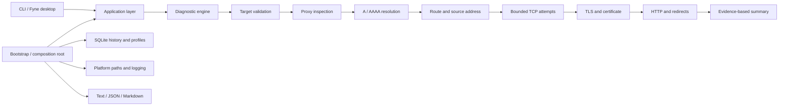
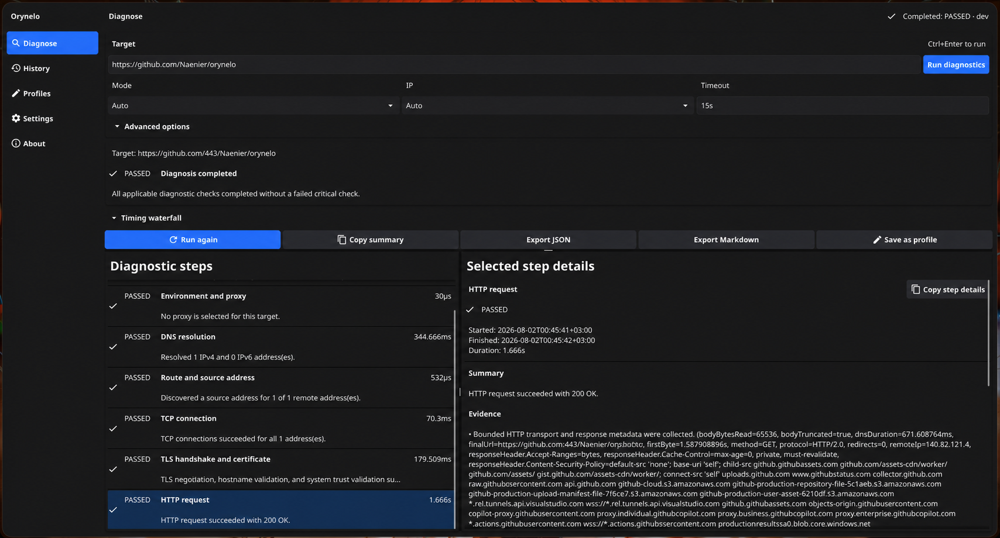

# Orynelo

Orynelo is an evidence-based network reachability diagnostic tool for
DevOps engineers. It follows a connection from target parsing through proxy,
DNS, route, TCP, TLS, and HTTP checks, then explains where the connection
stopped and which observations support that conclusion.

The project provides two interfaces over the same Go application layer:

- `orynelo`, a scriptable CLI with text, JSON, and Markdown reports.
- `orynelo-desktop`, a Fyne desktop application for interactive diagnosis,
  saved profiles, and local history.

Orynelo does not capture packets, scan port ranges, change firewall or DNS
settings, elevate privileges, or upload diagnostic data.

## Project status

Orynelo is under active development. The report schema is versioned, but
commands and storage migrations may still change. Linux
as the primary target, is the development platform. CI checks formatting,
static analysis, tests, and CLI/desktop builds on Linux. macOS and Windows
remain manual preview targets and should not yet be treated as fully supported.

## How it works



The domain model does not depend on Cobra, Fyne, SQLite, or a particular
logger. CLI and GUI code call the application layer directly; the desktop
application never shells out to the CLI. Checks accept `context.Context`,
have bounded timeouts and concurrency, and stream progress events while the
engine preserves deterministic result order.

Both interfaces submit only explicit run overrides. The application layer
combines defaults, configuration, an optional profile, and those overrides into
one validated, request-capable option set for execution. UI previews use a
separate privacy-projected copy, and completed diagnoses are projected before
reports or history can consume them. Application failures likewise share stable
categories and codes; their JSON-safe view never contains the wrapped technical
cause.

See [architecture](docs/architecture.md) and the
[diagnostic model](docs/diagnostic-model.md) for details.

## Quick start

Go 1.26.5 or newer is required by the module.

```bash
git clone https://github.com/Naenier/orynelo.git
cd orynelo
mkdir -p bin
go build -o bin/orynelo ./cmd/orynelo
./bin/orynelo diagnose https://example.com
```

The diagnostic target above is an example for interactive use. Unit tests use
local test servers and do not require the public Internet.

Useful CLI invocations:

```bash
./bin/orynelo diagnose https://example.com
./bin/orynelo diagnose tcp://git.example.internal:22
./bin/orynelo diagnose tls://mail.example.internal:465
./bin/orynelo diagnose https://example.com --ip-version 4
./bin/orynelo diagnose https://example.com \
  --probe-mode address-matrix --address-limit 4 --matrix-budget 5s
./bin/orynelo diagnose https://service.example \
  --connect-ip 192.0.2.40 --sni service.example --http-host service.example
./bin/orynelo diagnose https://service.example --ca-bundle ./internal-ca.pem
./bin/orynelo diagnose https://service.example \
  --expect-status 200-299 --latency-threshold 750ms
./bin/orynelo diagnose https://example.com --format json
./bin/orynelo diagnose https://example.com --format markdown --output report.md
./bin/orynelo diagnose https://example.com --anonymize strict --output report.json
./bin/orynelo diagnose https://example.com --allow-insecure-redirects
./bin/orynelo diagnose https://example.com --allow-private-redirects
./bin/orynelo version
./bin/orynelo version --json
./bin/orynelo completion bash
```

### Target and probe modes

The target syntax selects explicit transport semantics:

| Target form | Effective mode |
| --- | --- |
| `tcp://host:port` or `host:port` | TCP connect only |
| `tls://host:port` | TCP plus TLS handshake and certificate validation |
| `http://host/path` | HTTP |
| `https://host/path` or a bare hostname | HTTPS |

`--mode auto` keeps these parser semantics. For a scheme-less endpoint,
`--mode tcp` or `--mode tls` makes the intended transport explicit. Link-local
IPv6 targets may include a URL-escaped interface zone, for example
`tls://[fe80::2%25eth0]:443`. The normalized, privacy-safe target is retained
in results; raw userinfo and secret-like query values are not serialized.

The default `--probe-mode client-effective` follows a bounded Happy Eyeballs
style selection and reports the connection actually selected for the logical
request. It limits direct candidates so routine diagnosis stays close to
normal client behavior. `--probe-mode address-matrix` is an explicit backend
comparison: it checks a deterministic, bounded set of A/AAAA addresses and
records per-address DNS, route, TCP, and TLS evidence. `--address-limit`
defaults to four; omitted addresses are reported as skipped by the limit.
`--matrix-budget` is divided into independent per-address caps, while the
global and per-check deadlines still apply.

Results contain a correlated `NetworkPath` graph. Direct, HTTP-proxy, and
HTTPS-CONNECT routes are separate paths; proxy peers, origins, and redirects
are separate hops. Evidence and timings carry path, hop, and attempt IDs, so a
direct comparison cannot be mistaken for the proxy-backed request and
overlapping connection attempts cannot overwrite one another.
For HTTP targets, the short-lived direct preflight is explicitly auxiliary;
the path captured by the real HTTP transport is the client-effective route.

### Advanced diagnostic controls

| Flag | Purpose |
| --- | --- |
| `--probe-mode client-effective\|address-matrix` | Select normal client-like behavior or an explicit backend matrix |
| `--address-limit N` | Bound matrix addresses (`1`–`16`, default `4`) |
| `--matrix-budget DURATION` | Bound the total matrix budget used to derive independent attempt deadlines |
| `--connect-ip IP` | Dial one backend IP while preserving the target's logical identity |
| `--sni NAME` | Override both TLS SNI and the certificate hostname used for verification |
| `--http-host AUTHORITY` | Override the initial HTTP `Host` authority independently of SNI and dial IP |
| `--ca-bundle FILE` | Extend system roots with a bounded certificate-only PEM bundle |
| `--expect-status CODE_OR_RANGE` | Require one HTTP status or a range such as `200-299` |
| `--latency-threshold DURATION` | Fail the HTTP expectation when total latency exceeds the threshold |
| `--header 'Name: value'` | Add a repeatable, one-run request header whose value is never persisted or logged |
| `--dns-details` | Collect best-effort CNAME, TTL, resolver-source, and search-domain evidence |
| `--inspect-body` | Read bounded body metadata without retaining response content |

Custom CA bundles are additive to normal system trust. They cannot be combined
with `--insecure`, and private-key PEM blocks are rejected. `--connect-ip`,
`--sni`, and `--http-host` are intentionally independent for diagnosing one
load-balancer backend. One-run header values and CA contents are runtime-only;
only safe header names and the fact that a custom CA was configured may appear
in a report. Be aware that command arguments can still be visible in shell
history or the operating-system process list.

`--connect-ip` is intentionally fail-closed when a proxy route is selected:
Orynelo will not pretend that a proxy CONNECT to the logical hostname reached
the requested backend IP. Use `--no-proxy` for a fixed-backend run, or omit the
fixed IP when the proxy route itself is the subject of the diagnosis.

TLS results separate TCP dial, TLS handshake, and total duration for every
selected address. They include the peer chain, subject and issuer, DNS/IP SANs,
validity, public-key and signature metadata, negotiated version, cipher suite,
and ALPN. DNS results distinguish NXDOMAIN, NODATA, SERVFAIL, timeout,
family mismatch, and an ambiguous platform `not found` response. HTTP results
retain a redacted per-redirect hop with status, DNS/connect/TLS/TTFB/total
timings, selected remote/local endpoints, connection reuse, proxy selection,
and individual connect attempts. Body content remains excluded.

The CLI exit codes are:

| Code | Meaning |
| ---: | --- |
| `0` | Diagnostics completed without failed critical checks |
| `1` | Diagnostics completed and found a failure |
| `2` | Invalid input or configuration |
| `3` | Internal application error |
| `130` | Operation cancelled |

When `diagnose` is invoked with `--format json`, failures that occur before a
report is produced are written to standard error in this stable envelope:

```json
{
  "error": {
    "category": "validation",
    "code": "APP_DIAGNOSE_OPTIONS_INVALID",
    "messageId": "error.diagnose_options_invalid",
    "arguments": {
      "field": "target"
    }
  }
}
```

`arguments` is omitted when empty. It contains only privacy-projected values;
the wrapped technical cause is never included in the JSON envelope.

## Desktop application



Install the native libraries required to compile Fyne for your distribution.
Go 1.26.5 or newer must also be available.

### Debian and Ubuntu

```bash
sudo apt-get update
sudo apt-get install --no-install-recommends \
  gcc \
  libgl1-mesa-dev \
  libxkbcommon-dev \
  libwayland-dev \
  make \
  xorg-dev
```

### Arch Linux

```bash
sudo pacman -S --needed \
  base-devel \
  libxcursor \
  libxi \
  libxinerama \
  libxkbcommon \
  libxrandr \
  wayland \
  xorg-server-devel
```

### Fedora

```bash
sudo dnf install \
  gcc \
  libXcursor-devel \
  libXi-devel \
  libXinerama-devel \
  libXrandr-devel \
  libXxf86vm-devel \
  libxkbcommon-devel \
  make \
  mesa-libGL-devel \
  wayland-devel
```

Then build or run the desktop entry point:

```bash
make build-gui
./bin/orynelo-desktop

# or
make run-gui
```

The desktop window opens at `1280x820` and has a minimum size of `1050x680`.
Its navigation rail provides five screens:

- **Diagnose** streams the ordered check timeline and shows the summary, timing
  waterfall, evidence, recommendations, technical details, and export actions.
- **History** searches and filters locally stored runs and can open, rerun,
  export, or delete a selected diagnosis.
- **Profiles** creates and manages reusable, non-secret diagnostic settings.
- **Settings** configures diagnostics, networking, history, appearance, and
  logging.
- **About** shows build information, project links, and open-source
  acknowledgements.

Keyboard shortcuts include `Ctrl+L` for the target field, `Ctrl+Enter` to run,
`Esc` to cancel, `Ctrl+E` to export, and `Ctrl+,` to open Settings. System,
light, and dark themes are supported.

Network and local application operations run outside the UI thread and can be
cancelled. GUI operation scopes reject stale responses, limit concurrent
reads, serialize mutations, and deliver lifecycle changes through `fyne.Do`.
The GUI uses the same diagnosis, redaction, reporting, configuration, and
persistence services as the CLI. Desktop builds opt into Fyne's `fyne.Do`
threading model.
For a Wayland-only local build, use:

```bash
make build-gui GUI_TAGS=wayland,migrated_fynedo
```

## Build from source

GNU Make provides the common developer commands:

```bash
make help
make fmt-check vet lint
make test
make test-race
make coverage
go test -tags=integration ./internal/diagnostics
make build
```

On Windows without GNU Make, use these basic Go commands for formatting,
vetting, testing, and building:

```powershell
New-Item -ItemType Directory -Force bin | Out-Null
go fmt ./...
go vet ./...
go test ./...
go test -race ./...
go build -o bin\orynelo.exe .\cmd\orynelo
go build -tags migrated_fynedo -o bin\orynelo-desktop.exe .\cmd\orynelo-desktop
```

Native Fyne build dependencies are still required for the desktop binary.
Make builds record the application version, commit, build date, and whether the
source tree was modified without rewriting tracked source files. Go module and
VCS metadata provide local-build fallbacks; otherwise the application reports
the current stage version (`0.5.0`).

## Releases

Release tags use `v<SemVer>`. A maintainer manually creates the annotated tag
and the GitHub Release title, notes, and prerelease/latest state. The tag
workflow only builds and attaches these Linux x86_64 assets to that existing
release:

- `orynelo_<version>_Linux_x86_64.tar.gz`;
- `orynelo-desktop_<version>_Linux_x86_64.tar.gz`;
- `SHA256SUMS.txt`.

The workflow never creates a release or changes its title or description.
Assets can appear a few minutes after the release is published. Download all
three files into the same directory and verify the archives with:

```bash
sha256sum -c SHA256SUMS.txt
```

## Docker

The container contains only the CLI, CA certificates, and the minimal
distroless runtime. It runs as a non-root user.

```bash
docker build -t orynelo:dev .
docker run --rm orynelo:dev diagnose https://example.com
```

Important: a container has its own network namespace, resolver configuration,
routes, interfaces, and possibly proxy environment. A diagnosis from Docker
describes connectivity from that container. It may not reproduce connectivity
from the host or from the desktop application.

Container history is ephemeral by default. Mount a named volume at
`/home/nonroot` when local history and profiles should survive container
removal:

```bash
docker run --rm -v orynelo-home:/home/nonroot orynelo:dev \
  diagnose https://example.com
```

## Supported platforms

| Platform | CLI | Desktop | Current support level |
| --- | --- | --- | --- |
| Ubuntu/Linux | Build and test target | Native Fyne build target | Primary, CI-checked |
| macOS | Native compile target | Native Fyne compile target | Manual preview |
| Windows 11 | Native compile target | Native Fyne compile target | Manual preview |

The CLI favors the Go standard library and cross-platform network APIs.
Platform-specific enrichment is optional and a missing operating-system tool
must not prevent the base diagnosis.

## Configuration and local data

Linux paths follow the XDG base-directory conventions:

| Data | Default path |
| --- | --- |
| Configuration | `~/.config/orynelo/config.yaml` |
| History and profiles | `~/.local/share/orynelo/orynelo.db` |
| Log | `~/.local/state/orynelo/orynelo.log` |

`XDG_CONFIG_HOME`, `XDG_DATA_HOME`, and `XDG_STATE_HOME` are honored. Native
application-data locations are used on macOS and Windows. Configuration,
database, and log files are created with private permissions where the
platform supports POSIX modes.

## Privacy and security

Orynelo has no telemetry, analytics, cloud account integration, automatic
uploads, or secret storage. Diagnostic data remains on the computer unless a
user explicitly exports or shares it.

Authorization and cookie headers, URL userinfo, proxy credentials, and
token-like query parameters are redacted before logging, reporting, or
persistence. Standard report anonymization keeps useful non-secret context;
`--anonymize strict` also hides URL paths and query values, internal hosts and
IP addresses, and recognizable local paths. Local report files are replaced
atomically with private permissions.

Proxy behavior is derived from `HTTP_PROXY`, `HTTPS_PROXY`, `ALL_PROXY`, and
`NO_PROXY` environment variables; the desktop setting does not claim native
system/PAC support. Invalid proxy configuration fails closed instead of
silently using a direct HTTP route. HTTPS-to-HTTP and public-to-private or
local redirects are blocked by default and require explicit unsafe opt-in
flags. Cross-origin redirects remove sensitive request headers. HTTP response
bodies are bounded and are not written to history. TLS verification is enabled
by default; `--insecure` is an explicit diagnostic override and is reported as
a warning.

Read the [security design](docs/security.md) and
[vulnerability reporting policy](.github/SECURITY.md) before handling sensitive
targets or reporting a security issue.

## License

Orynelo is available under the [MIT License](LICENSE).
