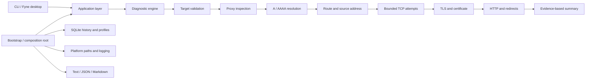

# OpsDoctor

OpsDoctor is an evidence-based network reachability diagnostic tool for
DevOps engineers. It follows a connection from target parsing through proxy,
DNS, route, TCP, TLS, and HTTP checks, then explains where the connection
stopped and which observations support that conclusion.

The project provides two interfaces over the same Go application layer:

- `opsdoctor`, a scriptable CLI with text, JSON, and Markdown reports.
- `opsdoctor-desktop`, a Fyne desktop application for interactive diagnosis,
  saved profiles, and local history.

OpsDoctor does not capture packets, scan port ranges, change firewall or DNS
settings, elevate privileges, or upload diagnostic data.

## Project status

OpsDoctor is under active development. The report schema is versioned, but
commands and storage migrations may still change. Linux, with Ubuntu 26.04 LTS
as the primary target, is the development platform. CI checks formatting,
static analysis, tests, and CLI/desktop builds on Linux. macOS and Windows
remain manual preview targets and should not yet be treated as fully supported.

## How it works



The domain model does not depend on Cobra, Fyne, SQLite, or a particular
logger. CLI and GUI code call the application layer directly; the desktop
application never shells out to the CLI. Checks accept `context.Context`,
have bounded timeouts and concurrency, and stream progress events while the
engine preserves deterministic result order.

See [architecture](docs/architecture.md) and the
[diagnostic model](docs/diagnostic-model.md) for details.

## Quick start

Go 1.26.5 or newer is required by the module.

```bash
git clone https://github.com/Naenier/opsdoctor.git
cd opsdoctor
mkdir -p bin
go build -o bin/opsdoctor ./cmd/opsdoctor
./bin/opsdoctor diagnose https://example.com
```

The diagnostic target above is an example for interactive use. Unit tests use
local test servers and do not require the public Internet.

Useful CLI invocations:

```bash
./bin/opsdoctor diagnose https://example.com
./bin/opsdoctor diagnose git.example.internal:22
./bin/opsdoctor diagnose https://example.com --ip-version 4
./bin/opsdoctor diagnose https://example.com --format json
./bin/opsdoctor diagnose https://example.com --format markdown --output report.md
./bin/opsdoctor version
./bin/opsdoctor version --json
./bin/opsdoctor completion bash
```

The CLI exit codes are:

| Code | Meaning |
| ---: | --- |
| `0` | Diagnostics completed without failed critical checks |
| `1` | Diagnostics completed and found a failure |
| `2` | Invalid input or configuration |
| `3` | Internal application error |
| `130` | Operation cancelled |

## Desktop application


Install the native libraries required to compile Fyne for your distribution.
Go 1.26.5 or newer must also be available.

### Debian and Ubuntu

```bash
sudo apt-get update
sudo apt-get install --no-install-recommends \
  gcc \
  libgl1-mesa-dev \
  libxkbcommon-dev \
  libwayland-dev \
  make \
  xorg-dev
```

### Arch Linux

```bash
sudo pacman -S --needed \
  base-devel \
  libxcursor \
  libxi \
  libxinerama \
  libxkbcommon \
  libxrandr \
  wayland \
  xorg-server-devel
```

### Fedora

```bash
sudo dnf install \
  gcc \
  libXcursor-devel \
  libXi-devel \
  libXinerama-devel \
  libXrandr-devel \
  libXxf86vm-devel \
  libxkbcommon-devel \
  make \
  mesa-libGL-devel \
  wayland-devel
```

Then build or run the desktop entry point:

```bash
make build-gui
./bin/opsdoctor-desktop

# or
make run-gui
```

The desktop window opens at `1280x820` and has a minimum size of `1050x680`.
Its navigation rail provides five screens:

- **Diagnose** streams the ordered check timeline and shows the summary, timing
  waterfall, evidence, recommendations, technical details, and export actions.
- **History** searches and filters locally stored runs and can open, rerun,
  export, or delete a selected diagnosis.
- **Profiles** creates and manages reusable, non-secret diagnostic settings.
- **Settings** configures diagnostics, networking, history, appearance, and
  logging.
- **About** shows build information, project links, and open-source
  acknowledgements.

Keyboard shortcuts include `Ctrl+L` for the target field, `Ctrl+Enter` to run,
`Esc` to cancel, `Ctrl+E` to export, and `Ctrl+,` to open Settings. System,
light, and dark themes are supported.

Network operations run outside the UI thread and can be cancelled. The GUI
uses the same diagnosis, redaction, reporting, configuration, and persistence
services as the CLI. Desktop builds opt into Fyne's `fyne.Do` threading model.
For a Wayland-only local build, use:

```bash
make build-gui GUI_TAGS=wayland,migrated_fynedo
```

## Build from source

GNU Make provides the common developer commands:

```bash
make help
make fmt-check vet lint
make test
make test-race
make coverage
go test -tags=integration ./internal/diagnostics
make build
```

On Windows without GNU Make, use these basic Go commands for formatting,
vetting, testing, and building:

```powershell
New-Item -ItemType Directory -Force bin | Out-Null
go fmt ./...
go vet ./...
go test ./...
go test -race ./...
go build -o bin\opsdoctor.exe .\cmd\opsdoctor
go build -tags migrated_fynedo -o bin\opsdoctor-desktop.exe .\cmd\opsdoctor-desktop
```

Native Fyne build dependencies are still required for the desktop binary.
Make builds record the commit, build date, and whether the source tree was
modified without rewriting tracked source files. Go module and VCS metadata
provide local-build fallbacks; otherwise the application reports its build as
`dev`.

## Docker

The container contains only the CLI, CA certificates, and the minimal
distroless runtime. It runs as a non-root user.

```bash
docker build -t opsdoctor:dev .
docker run --rm opsdoctor:dev diagnose https://example.com
```

Important: a container has its own network namespace, resolver configuration,
routes, interfaces, and possibly proxy environment. A diagnosis from Docker
describes connectivity from that container. It may not reproduce connectivity
from the host or from the desktop application.

Container history is ephemeral by default. Mount a named volume at
`/home/nonroot` when local history and profiles should survive container
removal:

```bash
docker run --rm -v opsdoctor-home:/home/nonroot opsdoctor:dev \
  diagnose https://example.com
```

## Supported platforms

| Platform | CLI | Desktop | Current support level |
| --- | --- | --- | --- |
| Ubuntu/Linux | Build and test target | Native Fyne build target | Primary, CI-checked |
| macOS | Native compile target | Native Fyne compile target | Manual preview |
| Windows 11 | Native compile target | Native Fyne compile target | Manual preview |

The CLI favors the Go standard library and cross-platform network APIs.
Platform-specific enrichment is optional and a missing operating-system tool
must not prevent the base diagnosis.

## Configuration and local data

Linux paths follow the XDG base-directory conventions:

| Data | Default path |
| --- | --- |
| Configuration | `~/.config/opsdoctor/config.yaml` |
| History and profiles | `~/.local/share/opsdoctor/opsdoctor.db` |
| Log | `~/.local/state/opsdoctor/opsdoctor.log` |

`XDG_CONFIG_HOME`, `XDG_DATA_HOME`, and `XDG_STATE_HOME` are honored. Native
application-data locations are used on macOS and Windows. Configuration,
database, and log files are created with private permissions where the
platform supports POSIX modes.

## Privacy and security

OpsDoctor has no telemetry, analytics, cloud account integration, automatic
uploads, or secret storage. Diagnostic data remains on the computer unless a
user explicitly exports or shares it.

Authorization and cookie headers, URL userinfo, proxy credentials, and
token-like query parameters are redacted before logging, reporting, or
persistence. HTTP response bodies are bounded and are not written to history.
TLS verification is enabled by default; `--insecure` is an explicit diagnostic
override and is reported as a warning.

Read the [security design](docs/security.md) and
[vulnerability reporting policy](.github/SECURITY.md) before handling sensitive
targets or reporting a security issue.

## License

OpsDoctor is available under the [MIT License](LICENSE).
