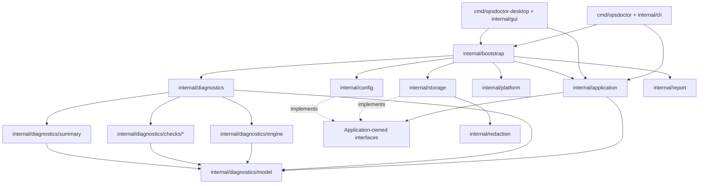
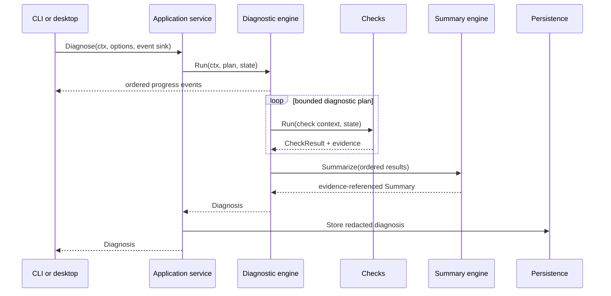

# Architecture

OpsDoctor separates network diagnosis from delivery mechanisms and
infrastructure. The CLI and desktop application are adapters over one
application layer and one diagnostic core.

## Dependency direction

Arrows point from a caller to a dependency. In particular:

- domain types do not import Fyne, Cobra, SQL, or concrete logging packages;
- presentation packages depend on the application layer, not on one another;
- application orchestration depends on interfaces it owns;
- storage and configuration adapters implement those interfaces;
- the bootstrap composition root is the only package that assembles concrete
  platform paths, SQLite, YAML, logging, reports, and the diagnostic runner;
- GUI callbacks convert domain values to presenter view models and do not
  contain diagnostic business logic.

No package named `utils`, `helpers`, or `common` is used. Shared behavior lives
under a name that states its responsibility, such as `redaction` or `report`.

## Runtime data flow

The diagnostic runner creates a global timeout context for the run. The engine
derives a per-check timeout without extending the parent deadline. Cancelling
the caller context propagates through DNS, dial, TLS, HTTP, event production,
and persistence boundaries.

## Diagnostic pipeline

The default plan is:

1. Parse and validate the target.
2. Inspect proxy environment and determine target-specific selection.
3. Resolve A and AAAA results according to the requested address family.
4. Select candidate addresses deterministically.
5. Discover the local source address and interface.
6. Make bounded TCP connection attempts.
7. Perform TLS negotiation and certificate validation when applicable.
8. Perform an HTTP request, bounded redirect traversal, and timing trace when
   applicable.
9. Produce a summary whose claims reference check results or evidence.

Independent address-family lookups and connection attempts may run in
parallel. Concurrency is capped by run options; result order follows the plan
and address order rather than goroutine completion order.

The HTTP transport performs its own bounded resolution intentionally: its
`httptrace` timings must describe the connection actually used after proxy
selection and redirects, which can differ from the direct-origin preflight.
The transport still enforces the selected IPv4/IPv6 mode.

## State and events

A run-local `State` carries the parsed target and results required by later
checks. It is never global. Checks update state through its synchronized API
and return complete values rather than sharing presentation objects.

The runner and engine emit run-started, check-started, check-completed, and
run-completed events to a synchronous sink that must return promptly.
`Runner.Stream` adapts consumers through a bounded, drop-on-full event channel.
The desktop sink schedules updates with non-blocking `fyne.Do`, so the network
goroutine does not wait for widget rendering. Final `Diagnosis.Checks`
ordering is authoritative even if events were observed at different times or
a progress event was dropped.

The desktop adapter marshals widget mutations onto the Fyne UI thread.
Network goroutines do not update widgets directly. Desktop build commands use
the `migrated_fynedo` tag after this migration so Fyne enforces the current
threading model without its legacy compatibility queue.

## Network and platform boundaries

The base diagnosis uses Go's `net`, `net/http`, `crypto/tls`, `net/url`, and
`httptrace` APIs. Route/source discovery can use an unconnected or connected
UDP socket to ask the operating system which local address it would choose,
without sending application data.

Optional platform enrichment is isolated under `internal/platform`. If an
external operating-system utility is ever used, it must be invoked with
`exec.CommandContext` and separate arguments. Its absence or failure produces
optional evidence and cannot break the cross-platform base result.

## Storage and configuration

Configuration is YAML with an explicit schema version, strict field decoding,
bounded file size, validation, atomic replacement, and private permissions.

SQLite history uses explicit tables and ordered forward migrations. Diagnoses,
checks, evidence, recommendations, profiles, and metadata remain queryable;
the database is not merely an opaque serialization of Go structures. A
versioned JSON snapshot may be stored as supplementary recovery data.

Infrastructure receives already-redacted values and also applies redaction at
the persistence boundary. History retention is bounded, with 200 entries by
default.

## Reporting

Text output is for terminals, Markdown is for people and issue attachments,
and JSON is for automation. All formats derive from the same `Diagnosis`.
Machine output includes `schemaVersion: "1"`. ANSI styling is a CLI concern and
is disabled when output is not a terminal.

Reports are snapshots. They must never contain authorization headers, cookies,
proxy credentials, URL userinfo, sensitive query values, or a full response
body.

## Build metadata

`internal/buildinfo` is the single source of runtime build metadata for the CLI
version command, GUI About screen, and stored history. Make builds inject the
commit, build date, and source-tree modification state, while
`runtime/debug.ReadBuildInfo` supplies VCS and module fallbacks for local or
`go install` builds. When no module version is available, the displayed build
version is `dev`. Nothing rewrites a tracked Go source file during a build.
