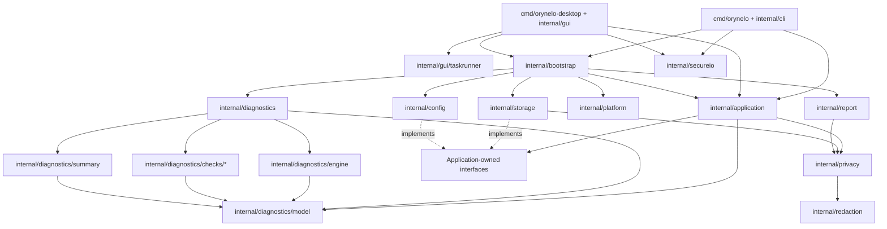
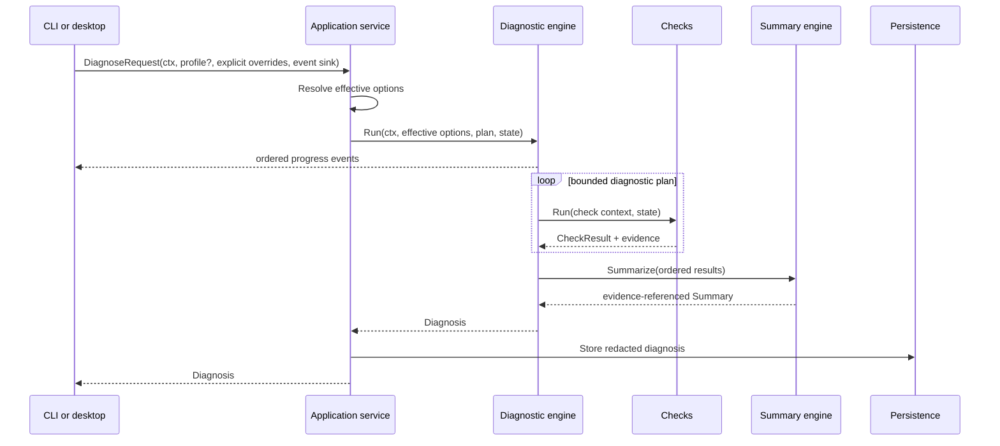
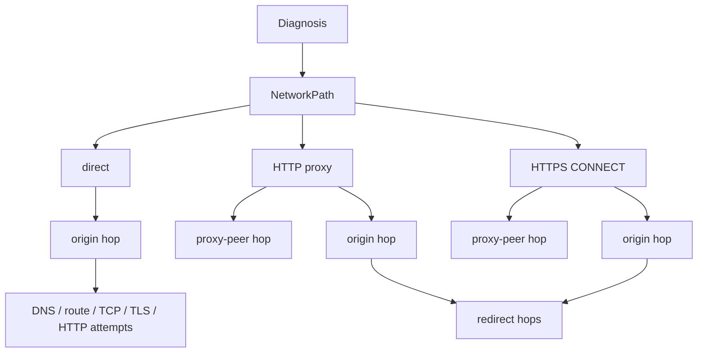

# Architecture

Orynelo separates network diagnosis from delivery mechanisms and
infrastructure. The CLI and desktop application are adapters over one
application layer and one diagnostic core.

## Dependency direction

Arrows point from a caller to a dependency. In particular:

- domain types do not import Fyne, Cobra, SQL, or concrete logging packages;
- presentation packages depend on the application layer, not on one another;
- application orchestration depends on interfaces it owns;
- storage and configuration adapters implement those interfaces;
- the bootstrap composition root is the only package that assembles concrete
  platform paths, SQLite, YAML, logging, reports, and the diagnostic runner;
- GUI callbacks convert domain values to presenter view models and do not
  contain diagnostic business logic.

No package named `utils`, `helpers`, or `common` is used. Shared behavior lives
under a name that states its responsibility, such as `redaction` or `report`.

## Runtime data flow

The diagnostic runner creates a global timeout context for the run. The engine
derives a per-check timeout without extending the parent deadline. Cancelling
the caller context propagates through DNS, dial, TLS, HTTP, event production,
and persistence boundaries.

CLI and desktop inputs use `DiagnoseOverrides`, whose pointer fields distinguish
an omitted value from an explicit `false` or zero. `ResolveDiagnoseOptions`
merges model defaults, one configuration snapshot, an optional saved profile,
and explicit run overrides in that order. It then normalizes mode, target, HTTP
method, and limits and validates the complete result. The returned
`DiagnoseOptions` is request-capable and belongs only to the execution path; it
must not be displayed or serialized. `PreviewDiagnoseOptions` resolves the same
precedence chain and applies the selected privacy projection. Its result is the
only effective option value safe for UI display or serialization. Completed
diagnoses are projected by the application service before reports, history, or
reruns consume them; adapters do not maintain separate merge rules.

Before the direct-origin comparison can consume the global deadline, the
runner reserves part of it for the actual HTTP route. When a proxy is selected,
direct DNS, route, TCP, and TLS results are explicitly marked as auxiliary
comparisons; the proxy-backed HTTP request remains the authoritative client
path. Invalid proxy configuration skips those direct network probes and fails
closed.

## Application error boundary

Application failures expose a typed contract independent of Cobra and Fyne.
Each error has one of the stable categories `validation`, `configuration`,
`storage`, `permission`, `cancelled`, `network-policy`, or `internal`, plus a
machine-readable code, a localizable message ID, and privacy-projected
arguments. Cancellation, deadline, and permission causes retain their standard
`errors.Is` behavior.

The wrapped infrastructure cause remains available through `errors.Unwrap` for
safe logging, but is private and is never included in `Error()`, `ErrorView`, or
JSON. CLI automation and desktop presentation therefore consume the same safe
classification without exposing database paths, credentials, or raw operating
system errors.

## Diagnostic pipeline

The default plan is:

1. Parse and validate the target.
2. Inspect proxy environment and determine target-specific selection.
3. Resolve A and AAAA results according to the requested address family.
4. Select candidate addresses deterministically.
5. Discover the local source address and interface.
6. Make bounded TCP connection attempts.
7. Perform TLS negotiation and certificate validation when applicable.
8. Perform an HTTP request, bounded redirect traversal, and timing trace when
   applicable.
9. Produce a summary whose claims reference check results or evidence.

Independent address-family lookups and connection attempts may run in
parallel. Concurrency is capped by run options; result order follows the plan
and address order rather than goroutine completion order.

The HTTP transport performs its own bounded resolution intentionally: its
`httptrace` timings must describe the connection actually used after proxy
selection and redirects, which can differ from the direct-origin preflight.
The transport still enforces the selected IPv4/IPv6 mode.

## Network paths and probe scopes

The run-local state builds a correlated graph instead of treating every
network observation as if it described one endpoint:

`NetworkRef` joins a fact to one path, hop, and attempt. Check results expose
all refs they cover, while evidence, route/TCP results, TLS attempts, HTTP
hops, redirect edges, and phase timings retain the precise ref. Proxy socket
addresses belong to `proxy_peer`; the logical upstream remains an `origin`.
When a redirect changes route, the new path links to the preceding path rather
than rewriting it. The graph is copied into `Diagnosis.NetworkPaths` before
summary construction and privacy projection.

Paths carry one of three roles. `client_effective` is the actual client route;
`address_matrix` is an explicitly requested backend comparison; and
`auxiliary_direct` is a direct-origin observation that must not be confused
with a selected proxy route. Older flat result fields remain selected
compatibility projections for schema-v1 readers.

The default `client_effective` probe uses a bounded Happy Eyeballs-style TCP
selection and follows the selected successful attempt through TLS. The
`address_matrix` probe uses stable address order, an explicit address limit,
bounded workers, and independent deadlines derived by dividing the matrix
budget. Addresses omitted by the limit are visible in evidence. This prevents
one slow backend from consuming the whole run while making heterogeneous DNS,
TCP, or certificate behavior observable.

Target parsing has explicit `tcp`, `tls`, `http`, and `https` effective modes.
Interface-level `auto`, `tcp`, and `tls` controls resolve only ambiguous input;
they cannot silently contradict an explicit URI. A link-local IPv6 literal may
retain a validated interface zone. The normalized target is report-safe, while
the request-capable URL remains runtime-only.

TLS matrix attempts separate TCP dial, handshake, and total durations and
retain the complete report-safe peer chain and negotiated parameters. Custom
CA data extends the system trust pool through `internal/trust`; CA bytes and
paths never cross the persistence boundary. Connect IP, TLS SNI/verification
identity, and HTTP Host are independent execution inputs.

DNS records typed per-family outcomes and optionally enriches them with CNAME,
TTL, resolver-source, and search-domain evidence. HTTP tracing creates one
redacted hop per redirect and one record per connect callback, including reuse,
selected endpoints, proxy choice, and DNS/connect/TLS/TTFB/total phases.
Expected status and latency are explicit assertions. Request-header values and
body content remain outside persisted state; bounded body metadata collection
is opt-in.

## State and events

A run-local `State` carries the parsed target and results required by later
checks. It is never global. Checks update state through its synchronized API
and return complete values rather than sharing presentation objects.

The runner and engine emit run-started, check-started, check-completed, and
run-completed events to a synchronous sink that must return promptly.
`Runner.Stream` adapts consumers through a bounded, drop-on-full event channel.
The desktop sink schedules updates with non-blocking `fyne.Do`, so the network
goroutine does not wait for widget rendering. Final `Diagnosis.Checks`
ordering is authoritative even if events were observed at different times or
a progress event was dropped.

The desktop adapter marshals widget mutations onto the Fyne UI thread.
Network goroutines do not update widgets directly. Desktop build commands use
the `migrated_fynedo` tag after this migration so Fyne enforces the current
threading model without its legacy compatibility queue.

Non-diagnostic desktop work uses an application-lifetime GUI task runner.
Each independently replaceable operation scope has a monotonically increasing
operation ID and the lifecycle `idle`, `loading`, `success`, `error`, or
`cancelled`. Starting replacement work cancels the prior scope context; both
the operation ID and an internal revision prevent a late response from an
uncooperative dependency from reaching the observer. Closing a scope or the
root runner cancels its work and suppresses later delivery.

Observers are invoked only through the injected dispatcher (`fyne.Do` in the
desktop adapter). Read-only work has bounded concurrency (four by default),
while mutations accepted by one runner execute serially in acceptance order.
Task panics are contained as operation errors rather than terminating the GUI.

## Network and platform boundaries

The base diagnosis uses Go's `net`, `net/http`, `crypto/tls`, `net/url`, and
`httptrace` APIs. Route/source discovery can use an unconnected or connected
UDP socket to ask the operating system which local address it would choose,
without sending application data.

Optional platform enrichment is isolated under `internal/platform`. If an
external operating-system utility is ever used, it must be invoked with
`exec.CommandContext` and separate arguments. Its absence or failure produces
optional evidence and cannot break the cross-platform base result.

## Storage and configuration

Configuration is YAML with an explicit schema version, strict field decoding,
bounded file size, validation, atomic replacement, and private permissions.

SQLite history uses explicit tables and ordered forward migrations. Diagnoses,
checks, evidence, recommendations, profiles, and metadata remain queryable;
the database is not merely an opaque serialization of Go structures. A
versioned JSON snapshot may be stored as supplementary recovery data.

Infrastructure receives already-redacted values and also applies redaction at
the persistence boundary. History retention is bounded, with 200 entries by
default.

## Reporting

Text output is for terminals, Markdown is for people and issue attachments,
and JSON is for automation. All formats derive from the same `Diagnosis`.
Machine output includes `schemaVersion: "1"`. ANSI styling is a CLI concern and
is disabled when output is not a terminal.

Reports are snapshots. They must never contain authorization headers, cookies,
proxy credentials, URL userinfo, sensitive query values, or a full response
body.

`internal/privacy` is the single typed projection used by reports, history,
profiles, events, and clipboard text. Standard mode removes credentials and
secret-like values. User-selected strict mode additionally hides paths, query
values, internal hosts and addresses, and local filesystem paths.

`internal/secureio` atomically replaces local report files after a complete
write, sync, close, and private-mode temporary file. CLI and desktop file
exports use that same boundary. URI providers that expose only a write-closer
receive complete-write and close checks but are reported honestly as
non-atomic.

## Build metadata

`internal/buildinfo` is the single source of runtime build metadata for the CLI
version command, GUI About screen, and stored history. The current release is
version `0.5.0`. Make builds inject the version, commit, build date, and
source-tree modification state, while
`runtime/debug.ReadBuildInfo` supplies VCS and module fallbacks for local or
`go install` builds. When no injected or module version is available, the
displayed build version is the current stage version. Nothing rewrites a
tracked Go source file during a build.
