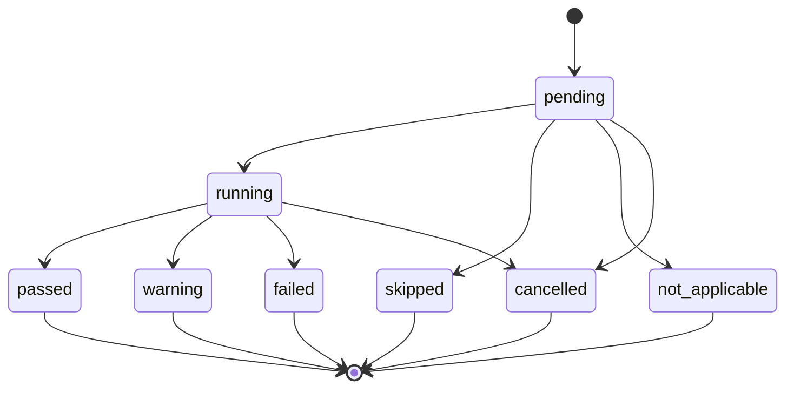

# Diagnostic model

The diagnostic model represents observations, lifecycle events, and
evidence-based conclusions independently of UI or persistence technology.

## Core entities

| Entity | Responsibility |
| --- | --- |
| `Diagnosis` | One complete, ordered run, its timing, target, build, checks, and summary |
| `Target` | Original-safe and normalized-safe target data plus protocol semantics |
| `NetworkPath` | One direct, HTTP-proxy, or HTTPS-CONNECT route through the network |
| `NetworkHop` | One origin, proxy peer, or redirect endpoint inside a path |
| `NetworkRef` | Stable path, hop, and attempt correlation carried by evidence and timings |
| `Check` | Context-aware unit of diagnostic work |
| `CheckResult` | Immutable outcome, timing, evidence, recommendations, and error code |
| `CheckEvent` | Best-effort progress update for CLI or GUI consumers |
| `Evidence` | Factual, already-redacted observation attributable to a check |
| `Recommendation` | Concrete next action tied to observed evidence |
| `Summary` | Overall status and restrained conclusion with evidence references |
| `BuildInfo` | Version, commit, build date, dirty flag, Go version, OS, and architecture |
| `Profile` | Reusable non-secret diagnostic options |
| `HistoryEntry` | Compact stored-run list projection |

The check contract is intentionally small:

```go
type Check interface {
    ID() string
    Name() string
    Run(ctx context.Context, state *State) CheckResult
}
```

The engine, rather than each check, controls plan ordering, per-check context,
event publication, panic containment at an untrusted check boundary, and final
normalization.

## Status lifecycle



- `passed` means the check's success condition was observed.
- `warning` means transport may work but a relevant risk or application-level
  problem was observed.
- `failed` means a required condition was not met.
- `skipped` means an applicable check could not safely run because a
  prerequisite or reserved auxiliary budget was unavailable.
- `not_applicable` means the check does not apply to the selected target or
  diagnostic mode.
- `cancelled` is distinct from timeout or network failure.

HTTP 4xx and 5xx results do not retroactively fail successful DNS, TCP, or TLS
checks. They remain application-layer outcomes after transport success.

## Check results

Every result contains:

```go
type CheckResult struct {
    ID              string
    Name            string
    Role            CheckRole
    Status          Status
    StartedAt       time.Time
    FinishedAt      time.Time
    Duration        time.Duration
    Summary         string
    Evidence        []Evidence
    NetworkRefs     []NetworkRef
    Recommendations []Recommendation
    ErrorCode       string
}
```

IDs are stable identifiers for code and report consumers. Names and summaries
are user-facing English text. `Duration` is derived from normalized timestamps.
An evidence item records a fact such as a selected proxy, resolved address,
socket error class, negotiated TLS version, certificate validity interval, or
HTTP status.

Technical errors retain structured classification after redaction. Stable
codes such as `TCP_CONNECTION_REFUSED`, `TCP_TIMEOUT`,
`TCP_NETWORK_UNREACHABLE`, and `TCP_CANCELLED` are preferred over matching
operating-system error strings.

`Role` distinguishes the actual client path from a temporary
`auxiliary_direct_comparison`. This prevents a direct-origin preflight result
from being presented as if it described a selected proxy route.

Address-specific route and TCP work has a separate attempt lifecycle:
`queued`, `running`, `completed`, `cancelled`, and `skipped`. Final state and
evidence contain only attempts that actually started. If a run is cancelled,
already completed attempts remain available while never-started addresses do
not produce placeholder IP families, errors, or evidence.

## Target semantics

Accepted forms include:

```text
example.com
example.com:443
tcp://example.com:22
tls://example.com:8443
https://example.com/path
http://10.10.0.25:8080/api/health
[2001:db8::1]:443
https://[2001:db8::1]/
tls://[fe80::2%25eth0]:443
```

The parsed `Target.Mode` is always one of `tcp`, `tls`, `http`, or `https`.
HTTP defaults to port 80 and HTTPS to 443. `tcp://` and `tls://` require an
explicit port and cannot contain URL paths, queries, userinfo, or fragments. A
host with an explicit port is a TCP target; a bare hostname uses the documented
HTTPS default on port 443. The interface-level `auto`, `tcp`, and `tls` modes
resolve ambiguous scheme-less input before parsing; a conflicting explicit URI
and mode is rejected instead of silently changing protocol semantics.

IPv6 addresses are normalized with brackets for URL or host-and-port output.
A zone is accepted only for a link-local IPv6 literal and is URL escaped as
`%25zone` when it appears in a URI. Internationalized hostnames are normalized
before DNS use.

`Original` and `Normalized` are report-safe forms. A raw request URL is kept
out of serialization because userinfo and query values can be sensitive.

## Effective run options

Interface input is represented as optional overrides rather than a complete
options value containing adapter defaults. The application layer resolves each
field with the precedence model defaults, configuration, optional profile,
then explicit override. This is also where TCP/TLS mode, target, method,
timeouts, address family, proxy behavior, redirects, and verbosity are
normalized and validated.

`ResolveDiagnoseOptions` returns the request-capable execution value, including
the target and user agent needed to perform network requests. That value must
not be displayed or serialized. `PreviewDiagnoseOptions` applies the requested
privacy projection to the same resolved fields and is the only effective option
value safe for preview or serialization.

After execution, `Diagnosis.Options` contains the application-projected value,
not the raw form input or request-capable resolver result. Report rendering and
history reruns therefore retain the same non-secret network semantics whether
the request originated in the CLI or desktop application.

Stage 3 options preserve three independent endpoint identities when requested:

- `ConnectIP` selects the physical backend address without changing the
  logical target;
- `ServerName` overrides both TLS SNI and certificate hostname verification;
- `HTTPHost` overrides the initial HTTP authority independently of the dial IP
  and SNI.

Custom CA bytes, the CA file path, and one-run request-header values are
execution-only fields with `json:"-"`. The system trust pool is extended, not
replaced, by a validated certificate-only CA bundle. Private-key PEM blocks
are rejected, custom CA and insecure mode are mutually exclusive, and only
safe request-header names are retained in projected options.

A fixed `ConnectIP` is applied only to a direct route. If proxy policy selects
a proxy, HTTP fails closed with `HTTP_CONNECT_IP_PROXY_UNSUPPORTED` instead of
silently sending CONNECT for the logical hostname and claiming that the fixed
backend was exercised.

The Stage 3 CLI maps directly to these application-owned contracts; the CLI
does not apply a second set of defaults:

| CLI flag | Application/model contract |
| --- | --- |
| `--mode auto\|tcp\|tls` | Resolves ambiguous input before the target parser; explicit URI conflicts fail validation |
| `--probe-mode client-effective\|address-matrix` | `ProbeModeClientEffective` or `ProbeModeAddressMatrix` |
| `--address-limit N` | `AddressLimit`, validated from 1 through 16 |
| `--matrix-budget DURATION` | `AddressMatrixBudget`, capped by the global timeout and divided into attempt budgets |
| `--connect-ip IP` | `ConnectIP`; a zone is valid only on link-local IPv6 |
| `--sni NAME` | `ServerName` for TLS SNI and hostname verification |
| `--http-host AUTHORITY` | `HTTPHost` for the initial request authority |
| `--ca-bundle FILE` | Runtime-only `CustomCABundlePath`; the runner loads bounded PEM into `CustomCAPEM` |
| `--expect-status CODE_OR_RANGE` | Explicit `ExpectedStatusMin/Max` plus `ExpectedStatusConfigured` |
| `--latency-threshold DURATION` | Positive `LatencyThreshold` assertion |
| `--header 'Name: value'` | Repeatable runtime-only `RequestHeaders`; projection keeps names only |
| `--dns-details` | Enables `CollectDNSDetails` best-effort enrichment |
| `--inspect-body` | Enables bounded metadata inspection without storing content |

## Correlated network paths

`Diagnosis.NetworkPaths` is the authoritative graph of concrete routes used or
compared during one diagnosis. Its identifiers are opaque within the run and
must not encode hostnames, addresses, or credentials.

```text
NetworkPath (direct | http_proxy | https_connect)
  role: client_effective | address_matrix | auxiliary_direct
  NetworkHop (origin | proxy_peer | redirect)
    selectedAttemptId
    NetworkAttempt (dns | route | tcp | tls | http)
    PhaseTiming
```

A `NetworkRef` contains `PathID`, `HopID`, and `AttemptID`. Path-specific
`CheckResult.NetworkRefs`, `Evidence.NetworkRef`, route and TCP records, TLS
attempts, HTTP hops, redirects, and phase timings use the same identity. The
reference is optional in JSON so schema-v1 snapshots written before path
correlation remain readable.

Direct-origin work, HTTP proxy traffic, and HTTPS CONNECT traffic never share
one path. A proxy path has a `proxy_peer` hop for the socket endpoint and a
separate `origin` hop for the logical destination; the proxy address is not
reported as the origin address. Redirects retain from/to references, and a
route change creates another path linked with `RedirectFromPathID`.

`NetworkAttempt` records its lifecycle, network, remote and local endpoint,
start and finish times, duration, selection/reuse state, and typed error.
`PhaseTiming` records an individual phase against the same attempt. Timings
belong to one attempt and are not overwritten when Happy Eyeballs or redirect
connections overlap. Older flat DNS, TLS, and HTTP fields remain selected
compatibility projections rather than competing sources of truth.

## Probe scopes and address selection

`client_effective` is the default scope. DNS produces a deterministic family
order, TCP uses bounded Happy Eyeballs behavior, and the winning connection is
marked selected. Direct candidate count is kept small; TLS follows only the
selected successful TCP attempt (or the first successful attempt when no
selection marker is available). The HTTP trace records the connection the
transport actually used. For HTTP targets the separate direct preflight has the
`auxiliary_direct` role even without a proxy, because its short-lived socket is
not the socket selected by the actual HTTP transport. It therefore cannot be
presented as the client route.

`address_matrix` is explicit opt-in for comparing multiple A/AAAA backends.
The candidate order remains stable, `AddressLimit` bounds the attempted set
(default four, validated from one through sixteen), and omitted candidates
produce `skipped_by_limit` evidence. `AddressMatrixBudget` is divided into
independent per-address context budgets capped by the check and run deadlines;
bounded concurrency prevents one slow backend from serially consuming the
entire diagnosis. Each selected backend retains its own route, TCP, TLS, and
error evidence. Mixed success is reported as a partial result rather than
being flattened to the first address.

## Protocol-specific evidence

### DNS and route

Each A and AAAA lookup has a `DNSFamilyResult` with one stable status:
`success`, `nxdomain`, `nodata`, `not_found_unknown`, `servfail`, `timeout`,
`cancelled`, `family_mismatch`, or `error`. This keeps a normal lack of AAAA
records distinct from a failed lookup and avoids deriving machine meaning from
platform-specific error strings.

With `CollectDNSDetails` enabled, an optional detailed resolver can add CNAMEs,
minimum TTL, resolver source, and search domains. These values are best effort:
an unsupported platform or detail lookup failure produces explicit evidence
without invalidating successful base A/AAAA resolution. Route evidence records
the selected source IP, interface state/name, MTU, family, and backend ref;
interface enumeration is cached for the run and partial failures remain
visible.

### TLS

Every selected backend produces a `TLSAttempt`. TCP dial, TLS handshake, and
total durations are measured separately. The attempt records remote IP,
effective SNI, selected state, negotiated TLS version, cipher suite, ALPN, and
typed failure. The selected successful attempt is also projected into the
legacy `TLSResult`.

The complete peer chain is represented by report-safe `CertificateInfo`
values: subject, issuer, serial, DNS/IP SANs, validity interval and remaining
time, chain length, hostname/trust result, public-key algorithm/bits/curve,
signature algorithm, and CA flag. Hostname validation uses the effective
logical identity (`ServerName` override or target host), even when `ConnectIP`
chooses a different physical backend. A valid custom CA extends normal system
roots. `Insecure` still collects metadata but turns success into an explicit
warning; it never masquerades as verified trust. Matrix outcomes distinguish
all-pass, all-fail, and mixed `TLS_PARTIAL_FAILURE` results.

### HTTP and redirects

`HTTPResult.Hops` stores one redacted `HTTPHop` per request/response leg. A hop
contains URL, status, DNS/connect/TLS/first-byte/total timings, remote and local
IP when attributable, connection reuse, route, proxy selection, and its
individual `HTTPConnectAttempt` values. Failed and successful concurrent
connect callbacks remain separate, and only the connection actually used is
selected. Proxy authentication and CONNECT rejection have distinct typed
failures.

Redirect records carry from/to network refs, the route selected for the next
URL, and the existing downgrade/private-network/cross-origin policy decision.
An explicit expected status or status range and an optional total-latency
threshold turn HTTP into a reproducible assertion; default HTTP status
classification remains in effect when no expectation was configured.

One-run headers are applied only to the initial request, and sensitive headers
are stripped on cross-origin redirects. Header values are never written to
events, reports, history, or logs. Body inspection is disabled by default; its
opt-in mode reads bounded metadata while response content itself remains
excluded from the model.

## Events and deterministic ordering

Events allow a desktop timeline or verbose CLI to show progress:

```text
run_started
check_started
check_completed
run_completed
```

Each event carries a timestamp and check index. Parallel work can complete in
any order, so consumers use the index for display. The final diagnosis always
stores results in deterministic plan order.

Events are not a durable audit log. The complete final diagnosis is the source
of truth for reporting and history.

Before any event leaves the application layer, the same typed privacy
projection used by reports and history is applied to its result and timestamp.

## Proxy and redirect contracts

`ProxySelection` records the source environment variable, redacted proxy URL,
validity, and bypass reason. Its request-capable URL is runtime-only. Invalid
configuration has the stable `PROXY_CONFIG_INVALID` code and cannot turn into
an implicit direct request. Configured, selected, `NO_PROXY`-bypassed,
explicitly disabled, and non-applicable states remain distinct.

Redirect evidence records each safe source and destination, cross-origin
state, sensitive headers actually removed, network scopes, and the policy
decision. HTTPS downgrade and public-to-private/local transitions are blocked
unless the corresponding unsafe option was explicitly selected. Hop count,
each `Location` value, and the global request chain are bounded.

## Summary rules

A summary first gathers all facts, creates conclusion candidates, and then
ranks them by semantic severity: blocker, interrupted run, degraded-path
warning, and informational note. Rule specificity breaks ties inside a
severity. Plan order alone never allows an earlier route or partial TCP warning
to hide a later TLS or HTTP blocker. Claims must remain within the evidence.

`CHECK_TIMEOUT` is distinct from a network timeout and records the check/stage,
configured per-check budget, elapsed time, and a dedicated evidence ID. A
completed HTTP response is evidence about the actual client path. Failed
direct preflight checks that conflict with that response are presented as a
path discrepancy (and as auxiliary direct comparison when a proxy was used),
not as proof that the actual request failed.

For example:

> The TCP connection timed out for all resolved addresses. This is consistent
> with packet filtering, an unavailable route, or a silent remote host.

The timeout does not prove that a firewall blocked traffic. Recommended next
steps can ask the user to check a listener, route, security group, or firewall,
but the conclusion cannot state that an unobserved component is the cause.

Rules cover at least:

- invalid targets and DNS failure;
- IPv4/IPv6 asymmetric success;
- all-refused, all-timeout, and mixed TCP outcomes;
- expired, not-yet-valid, hostname-mismatched, and unknown-authority
  certificates;
- redirect loops and HTTP 4xx/5xx responses;
- selected or bypassed proxy behavior;
- success only after explicit proxy disablement;
- cancellation.

Every conclusion carries references to check or evidence IDs.

## JSON schema envelope

JSON reports use a stable envelope:

```json
{
  "schemaVersion": "1",
  "diagnosis": {}
}
```

New optional fields can be added within schema version 1 when old readers can
ignore them safely. Removing a field, changing its meaning or type, or changing
status/error-code semantics requires a new schema version and migration
documentation.

Durations are encoded consistently by the report package, and timestamps are
UTC RFC 3339 values. Reports never serialize a raw unredacted request URL or
HTTP response body.
