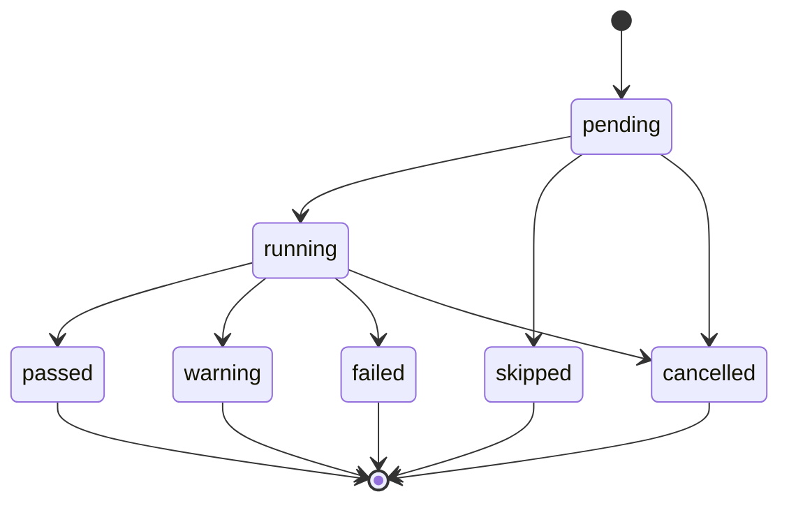

# Diagnostic model

The diagnostic model represents observations, lifecycle events, and
evidence-based conclusions independently of UI or persistence technology.

## Core entities

| Entity | Responsibility |
| --- | --- |
| `Diagnosis` | One complete, ordered run, its timing, target, build, checks, and summary |
| `Target` | Original-safe and normalized-safe target data plus protocol semantics |
| `Check` | Context-aware unit of diagnostic work |
| `CheckResult` | Immutable outcome, timing, evidence, recommendations, and error code |
| `CheckEvent` | Best-effort progress update for CLI or GUI consumers |
| `Evidence` | Factual, already-redacted observation attributable to a check |
| `Recommendation` | Concrete next action tied to observed evidence |
| `Summary` | Overall status and restrained conclusion with evidence references |
| `BuildInfo` | Version, commit, build date, dirty flag, Go version, OS, and architecture |
| `Profile` | Reusable non-secret diagnostic options |
| `HistoryEntry` | Compact stored-run list projection |

The check contract is intentionally small:

```go
type Check interface {
    ID() string
    Name() string
    Run(ctx context.Context, state *State) CheckResult
}
```

The engine, rather than each check, controls plan ordering, per-check context,
event publication, panic containment at an untrusted check boundary, and final
normalization.

## Status lifecycle



- `passed` means the check's success condition was observed.
- `warning` means transport may work but a relevant risk or application-level
  problem was observed.
- `failed` means a required condition was not met.
- `skipped` states why a check did not apply or could not safely run.
- `cancelled` is distinct from timeout or network failure.

HTTP 4xx and 5xx results do not retroactively fail successful DNS, TCP, or TLS
checks. They are application-response warnings after transport success.

## Check results

Every result contains:

```go
type CheckResult struct {
    ID              string
    Name            string
    Status          Status
    StartedAt       time.Time
    FinishedAt      time.Time
    Duration        time.Duration
    Summary         string
    Evidence        []Evidence
    Recommendations []Recommendation
    ErrorCode       string
}
```

IDs are stable identifiers for code and report consumers. Names and summaries
are user-facing English text. `Duration` is derived from normalized timestamps.
An evidence item records a fact such as a selected proxy, resolved address,
socket error class, negotiated TLS version, certificate validity interval, or
HTTP status.

Technical errors retain structured classification after redaction. Stable
codes such as `TCP_CONNECTION_REFUSED`, `TCP_TIMEOUT`,
`TCP_NETWORK_UNREACHABLE`, and `TCP_CANCELLED` are preferred over matching
operating-system error strings.

## Target semantics

Accepted forms include:

```text
example.com
example.com:443
https://example.com/path
http://10.10.0.25:8080/api/health
[2001:db8::1]:443
https://[2001:db8::1]/
```

HTTP defaults to port 80 and HTTPS to 443. A host with an explicit port is a
TCP target. A bare hostname uses the safe, documented HTTPS default on port
443; users can select TCP mode explicitly in the desktop application. IPv6
addresses are normalized with brackets for URL or host-and-port output.
Internationalized hostnames are normalized before DNS use.

`Original` and `Normalized` are report-safe forms. A raw request URL is kept
out of serialization because userinfo and query values can be sensitive.

## Events and deterministic ordering

Events allow a desktop timeline or verbose CLI to show progress:

```text
run_started
check_started
check_completed
run_completed
```

Each event carries a timestamp and check index. Parallel work can complete in
any order, so consumers use the index for display. The final diagnosis always
stores results in deterministic plan order.

Events are not a durable audit log. The complete final diagnosis is the source
of truth for reporting and history.

## Summary rules

A summary selects the earliest meaningful failure and then considers mixed or
upper-layer outcomes. Claims must remain within the evidence.

For example:

> The TCP connection timed out for all resolved addresses. This is consistent
> with packet filtering, an unavailable route, or a silent remote host.

The timeout does not prove that a firewall blocked traffic. Recommended next
steps can ask the user to check a listener, route, security group, or firewall,
but the conclusion cannot state that an unobserved component is the cause.

Rules cover at least:

- invalid targets and DNS failure;
- IPv4/IPv6 asymmetric success;
- all-refused, all-timeout, and mixed TCP outcomes;
- expired, not-yet-valid, hostname-mismatched, and unknown-authority
  certificates;
- redirect loops and HTTP 4xx/5xx responses;
- selected or bypassed proxy behavior;
- success only after explicit proxy disablement;
- cancellation.

Every conclusion carries references to check or evidence IDs.

## JSON schema envelope

JSON reports use a stable envelope:

```json
{
  "schemaVersion": "1",
  "diagnosis": {}
}
```

New optional fields can be added within schema version 1 when old readers can
ignore them safely. Removing a field, changing its meaning or type, or changing
status/error-code semantics requires a new schema version and migration
documentation.

Durations are encoded consistently by the report package, and timestamps are
UTC RFC 3339 values. Reports never serialize a raw unredacted request URL or
HTTP response body.
