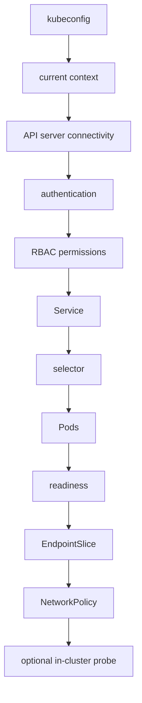

# Roadmap

Orynelo is organized around usable phases rather than inactive screens or
commands. A feature appears in the CLI or desktop application only when its
diagnostic path, evidence, cancellation, redaction, tests, and documentation
work end to end.

Dates are intentionally not promised here. Priorities follow user evidence,
security review, and verified platform-build results.

## Endpoint diagnostics

The current scope focuses on:

- robust URL, hostname, port, IPv4, IPv6, and IDN parsing;
- proxy environment-variable and `NO_PROXY` interpretation;
- separate A and AAAA results;
- source-address and interface discovery;
- bounded TCP attempts with typed error classification;
- verified TLS negotiation and certificate metadata;
- bounded HTTP requests, redirects, and `httptrace` timing;
- evidence-referenced summaries;
- cancellation and streamed progress;
- text, JSON, and Markdown reports;
- local YAML configuration, SQLite history, and saved profiles;
- a shared CLI and Fyne desktop application;
- centralized request-capable option resolution plus privacy-projected previews
  shared by CLI, profiles, and GUI;
- typed, privacy-safe application errors for UI and JSON consumers;
- cancellable GUI operation scopes with stale-response suppression, bounded
  reads, and serialized mutations;
- build metadata, cross-platform builds, and a non-root CLI container.

Hardening continues through fuzzing of target and certificate inputs, more
platform-specific error fixtures, migration compatibility tests, accessibility
review, and verified build smoke tests.

## Kubernetes diagnostics

Kubernetes service diagnosis is a future, separately delivered phase. The
planned CLI starts with:

```bash
orynelo kube service \
  --context my-cluster \
  --namespace default \
  --service api
```

The intended evidence pipeline is:



### Design constraints

- Use `client-go` typed clients and discovery APIs rather than invoking
  `kubectl` or parsing its output.
- Do not add `client-go` while no Kubernetes feature
  consumes it.
- Never collect bearer tokens, client keys, exec-plugin output, or full
  kubeconfig content in reports or history.
- Respect explicit context and namespace selection. Do not silently switch the
  user's current context.
- Request the smallest practical read-only RBAC permissions and report missing
  permissions as evidence, not as a reason to request cluster-admin.
- Bound list sizes, API timeouts, watches, concurrent requests, and response
  payloads.
- Do not create a debug Pod by default. An in-cluster probe is a later,
  explicit, separately confirmed operation with a visible manifest, bounded
  lifetime, deterministic cleanup, and no privileged mode.
- Do not add a disabled Kubernetes page to the desktop UI.

### Planned checks

#### 1. Kubeconfig and context

Load using standard client-go rules, identify the selected file sources
without exposing their content, validate the requested context, and report the
cluster server hostname after redaction. Detect missing context, malformed
configuration, unsupported authentication plugins, and certificate reference
errors separately.

#### 2. API server connectivity

Measure DNS, TCP, and TLS behavior to the configured API server using the
existing endpoint diagnostic concepts where practical. Distinguish network
failure from an HTTP Kubernetes API response.

#### 3. Authentication

Perform a low-impact API request and distinguish no credentials, expired
credentials, rejected credentials, exec-plugin failure, and server-side
authentication errors. Never print credential material.

#### 4. Authorization

Use `SelfSubjectAccessReview` for the exact read operations needed by later
checks. Show which checks will be unavailable when permissions are missing.
Do not infer broad authorization from one successful request.

#### 5. Service

Fetch the named Service and record type, ports, target ports, IP families,
cluster IPs, external traffic policy, and relevant annotations after
redaction. Validate named target-port resolution without assuming every
backend container uses the same numeric port.

#### 6. Selector and Pods

Evaluate the Service selector and list a bounded set of matching Pods. Report
an empty selector, no matches, terminating Pods, scheduling state, container
restart counts, and declared ports. A headless or `ExternalName` Service takes
an appropriate alternative path.

#### 7. Readiness

Inspect Pod conditions and container readiness without treating a single
snapshot as proof of long-term health. Link unready evidence to the affected
Pod and container; do not persist environment variables or Secret-backed
values.

#### 8. EndpointSlice

Use discovery.k8s.io EndpointSlice resources, not deprecated Endpoints as the
primary source. Correlate ready, serving, and terminating conditions, address
families, ports, zones, and target references. Detect disagreement between
ready Pods and published endpoints.

#### 9. NetworkPolicy

List only policies in relevant namespaces and explain selectors and declared
ingress/egress constraints. Policy objects alone cannot prove enforcement or
the cause of a timeout; summaries must say that observed policies are
consistent with or do not explain a path.

#### 10. Optional in-cluster probe

If later implemented, the probe will be opt in and require an explicit
confirmation because it mutates cluster state. It will use a pinned,
minimal image, non-root security context, no host namespaces, no privilege
escalation, a read-only root filesystem, dropped capabilities, resource
limits, a deadline, labels for ownership, and best-effort cleanup with clear
manual cleanup instructions.

### Delivery phases

1. Read-only kubeconfig, context, API connectivity, authentication, and RBAC.
2. Read-only Service, selector, Pod, readiness, and EndpointSlice correlation.
3. Read-only NetworkPolicy interpretation with evidence-linked summaries.
4. CLI reports and history redaction for Kubernetes-specific entities.
5. Desktop presentation after the CLI path is stable and accessible.
6. Optional in-cluster probe only after a separate threat model and security
   review.

## Deliberate non-goals

The roadmap does not include arbitrary remote command execution, automatic
firewall or DNS modification, broad port scanning, privilege escalation,
telemetry, cloud credential collection, or an always-on cluster agent.
