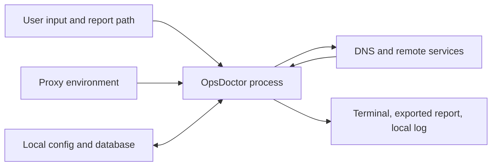

# Security design

OpsDoctor processes untrusted targets, environment values, configuration,
network responses, certificates, and report paths. Its security posture is to
collect the minimum evidence needed for diagnosis while bounding work and
keeping data local.

For confidential vulnerability reports, follow
[SECURITY.md](../.github/SECURITY.md).

## Trust boundaries



The process does not assume that:

- a URL, hostname, header, certificate, DNS answer, or response is well formed;
- a remote peer is cooperative;
- proxy environment variables are trustworthy;
- a report destination is private;
- an operating-system error string is stable;
- container networking is equivalent to host networking.

## Privacy properties

OpsDoctor has:

- no telemetry or analytics;
- no cloud account integration;
- no automatic uploads;
- no secret store;
- no background network activity unrelated to a user-started diagnosis.

Diagnostic history remains local. Users control explicit export and sharing.
Response bodies are read only up to the configured bound for transport
behavior and are not persisted by default.

## Redaction

Redaction applies before values reach logs, events, reports, history, or saved
profiles. Defense in depth applies it again at output and persistence
boundaries.

Sensitive headers include:

```text
Authorization
Proxy-Authorization
Cookie
Set-Cookie
```

Sensitive query keys include:

```text
token
access_token
code
code_verifier
jwt
session_id
assertion
ticket
api_key
apikey
key
secret
password
passwd
signature
sig
auth
credential
```

Matching is case insensitive and values become `[REDACTED]`. URL userinfo and
proxy credentials are removed. Logs never contain response bodies.

Redaction reduces accidental disclosure; it cannot recognize every secret
embedded in an arbitrary path, hostname, or nonstandard parameter. Users
should inspect reports before sharing them.

## Network safety

- Global and per-check contexts bound elapsed work.
- DNS, dial, TLS, and HTTP operations observe cancellation.
- Concurrent address attempts use a fixed upper bound.
- Redirect traversal is limited to 10 by default.
- Response reading is limited to 64 KiB by default.
- Idle HTTP connections, response bodies, sockets, files, and databases are
  closed.
- TLS verification is enabled by default.
- `--insecure` is an explicit temporary diagnostic option and creates a
  warning in the result.
- No port ranges, raw sockets, packet capture, or load generation are used.

Malformed network data is returned as a classified result or error; expected
runtime failures do not panic the process.

## Command execution and privileges

The base diagnostic path uses Go network APIs and does not require root.
OpsDoctor does not accept or execute arbitrary user commands, invoke a shell,
escalate privileges, or modify firewall, DNS, route, proxy, or certificate
settings.

Optional platform enrichment must use `exec.CommandContext` with a fixed
executable and separate fixed-position arguments. User input must never be
concatenated into a shell command. Missing platform tools degrade only the
optional evidence.

## Local files

On POSIX systems, application directories use mode `0700` and sensitive files
use `0600`. Configuration loading is bounded, uses strict YAML fields, and
rejects multiple YAML documents. Saves use a temporary file and atomic rename.

CLI report export opens the selected parent directory as an `os.Root`, rejects
symbolic links and non-regular destinations with `Lstat`, and repeats that
check immediately before replacement. Report bytes are written to a random
same-directory temporary file created exclusively with mode `0600`, synced,
and closed before an atomic `os.Root.Rename`. Replacing an existing hard link
changes only the selected directory entry; the other link and its prior
contents remain untouched.

SQLite uses ordered migrations and parameterized statements. Data is stored in
normalized tables so migrations and selective deletion remain possible.
History retention is bounded and can be disabled or cleared.

Exported reports use the path explicitly selected by the user. Callers should
avoid writing sensitive reports into shared directories.

## TLS interpretation

Certificate checks distinguish expiration, not-yet-valid certificates,
hostname mismatch, unknown authority, handshake timeout, protocol mismatch,
and early connection closure. The result records negotiated properties only
after a completed handshake.

An unknown authority is not reported as proof of interception; an enterprise
trust root may simply be unavailable to the process. A hostname mismatch is
not reported as proof of compromise. Recommendations describe verification
steps rather than asserting an unobserved cause.

## Containers

The container image contains only the CLI in a distroless runtime, runs as the
non-root `nonroot` account, and includes CA certificates. Build metadata is
passed as non-secret build arguments. `.dockerignore` excludes Git and CI
metadata, local environments, generated databases and logs, desktop assets,
`docs/`, screenshots, and maintainer policy files from the build context.
`README.md` and `LICENSE` remain available to the builder, but the final
runtime stage copies only the compiled CLI and its non-root home directory.

A container uses its own network namespace. Its DNS, routes, interfaces,
loopback, proxy variables, and firewall view may differ from the host. This is
a diagnostic limitation, not a sandbox escape mechanism.

## Supply chain

CI verifies module checksums, formatting, static analysis, tests, and the
Linux CLI/desktop builds. Dependabot tracks Go modules, GitHub Actions, and
Docker base images. Native packaging, race tests, vulnerability scanning, and
container validation remain available as explicit local checks. Container
labels retain the source, license, commit, and build date; the binary also
records whether its source tree was modified.

## Explicit non-goals

The first version does not implement packet capture, raw-socket scanning, port
range scanning, remote command execution, automatic network changes,
privilege escalation, telemetry, cloud accounts, secret storage, or
Kubernetes debug Pod creation.
